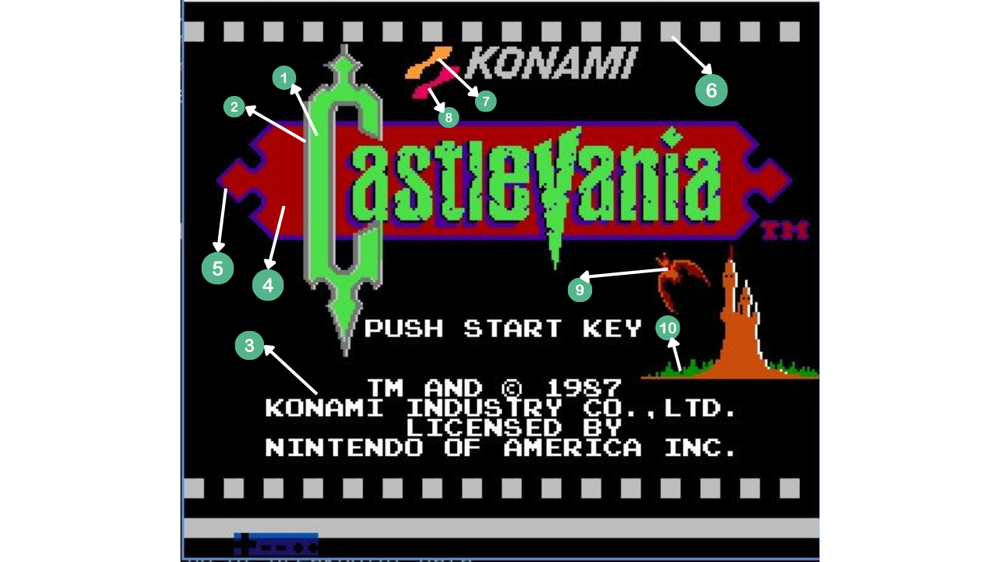
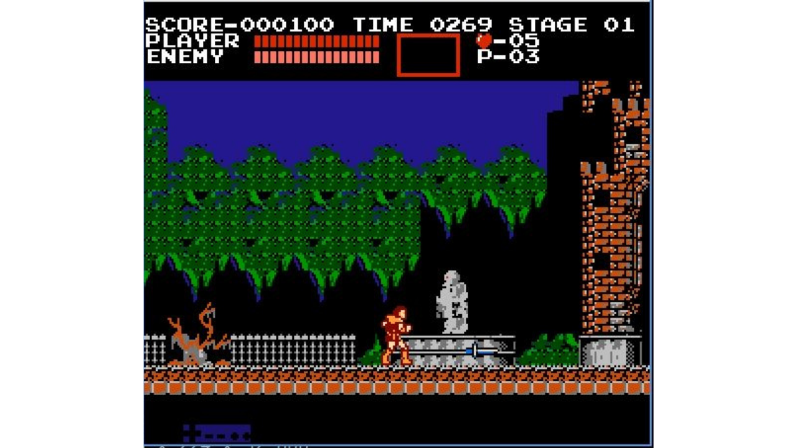
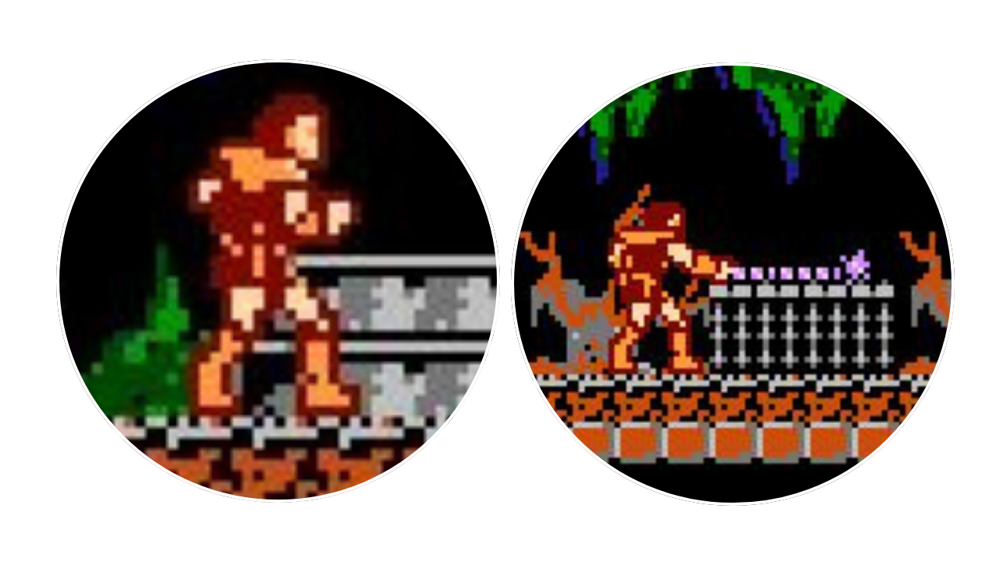

# Retro Gaming Retrospective: Castlevania Across Three Platforms

> *A visual hardware analysis of Colour Palettes and Tile & Sprite Sizing across the NES, Game Boy, and SNES - and a look at how far the series has come.*

---

## Introduction

I'll be honest - I am not a gamer. The only retro game I had played before starting this project was Pac-Man, so coming into this I had very little context for what made one game "better" than another visually. While researching options, I stumbled across Castlevania and immediately fell in love with the series. It felt like the inverse of my favourite movie series, *Hotel Transylvania* - instead of monsters being the loveable ones, you're hunting them down through a Gothic castle.

What I didn't expect was how dramatically the visuals would differ across the three versions. The moment I loaded each game side by side, the differences hit me immediately - and I found myself reaching back to concepts I'd studied in my graphics and computer architecture courses to understand *why* they looked the way they did.

That became the whole focus of this retrospective: **what does the game look like, and why does it look so different on each platform?**

The NES, Game Boy, and SNES each have hard limits on colour count, sprites per scanline, and video memory. Those constraints show up directly on screen - and Castlevania makes them *very* visible, because the same castle, the same enemies, and the same character have to be drawn within completely different hardware rules each time.

---

## Focus Areas

| Focus | Description |
|---|---|
| **Colour Palettes** | How each platform handles colour limitations and how that affects mood and visual detail |
| **Tile & Sprite Sizing** | Differences in tile dimensions used to build characters and environments, and how this impacts animation |

---

## Games Covered

| Platform | Game | Year | Notes |
|---|---|---|---|
| **NES** | *Castlevania* | 1987 | The original. Simon Belmont, a whip, a castle, and Dracula. |
| **Game Boy** | *Castlevania: The Adventure* | 1989 | First portable entry, released the same year as the Game Boy itself. |
| **SNES** | *Super Castlevania IV* | 1991 | The 16-bit reimagining. Widely considered one of the best games on the system. |

---

## Title Screens Across All Three Platforms

> Here you can see the title screen rendered on each of the three devices side by side. Even before you press start, the hardware constraints are written all over the screen.

Seeing all three next to each other, the NES one feels the most deliberately bold to me — the red and green logo against black is simple, but it works. The Game Boy one looks dense and a bit hard to read at a glance. The SNES one is clearly the most visually comfortable to look at, the stone texture actually feels solid.

---

## Part 1 - Colour Palettes

### NES - *Castlevania* (1987)

**Hardware Specs**
- **Resolution:** 256×240 pixels
- **PPU:** [Ricoh 2C02](https://www.nesdev.org/wiki/PPU)
- **Total palette:** [54 colours (25 usable simultaneously)](https://www.nesdev.org/wiki/PPU_palettes)
- **Background slots:** [13 colours (four 3-colour sub-palettes + 1 shared background)](https://www.nesdev.org/wiki/PPU_palettes)
- **Sprite slots:** [12 colours (four 3-colour sub-palettes + transparency)](https://www.nesdev.org/wiki/PPU_palettes)
- **Source:** [Carleton University SCS Vintage Computing Collection - VIN155](https://carleton.ca/scs/vintage-computing/item/vin155/)

**What I played:** `Castlevania (USA).nes` - loaded into FCEUX, launched from the terminal. I died repeatedly in Stage 1 and barely made it to Stage 2.

 

---

#### Title Screen Analysis

Looking at this title screen, the first thing I did was count the distinct colours - and I came up with just **10**. The whole thing is rendered as a single background layer with no active sprites. That number actually sits *below* the [theoretical 13-colour background ceiling](https://www.nesdev.org/wiki/PPU_palettes), and after reading about the NES PPU, I understand why: the artists deliberately kept the colour count low to avoid visible clashing at the mandatory [**16×16 pixel attribute grid**](https://www.nesdev.org/wiki/PPU_attribute_tables) boundaries.

This was one of those moments where my graphics coursework made something click. I'd learned about palette indexing and how hardware-imposed colour grids can create visual artefacts at tile borders - but seeing it as an active *design decision* rather than just a limitation was genuinely exciting. The [12 sprite-palette colours](https://www.nesdev.org/wiki/PPU_palettes) are completely untouched here since no sprites are active on the title screen.

> *The theoretical maximum of [25 simultaneous colours](https://www.nesdev.org/wiki/PPU_palettes) on the NES is only achievable when both the background layer and active sprites are drawing at the same time.*

---

#### Gameplay Colour Effect Analysis

Once I got into the game, the colour palette choices started telling a story. The deep blues and blacks create a moonlit night sky, the vibrant greens anchor the foreground foliage, and the oranges and browns give the castle walls their Gothic weight. The overall effect is genuinely good - more than I expected from 10 colours.

The technique that stood out most to me was **dithering** - alternating checkerboard pixel patterns that simulate gradients where smooth colour transitions would otherwise be impossible. I'd encountered dithering in my image processing studies as a method for approximating tonal values within a restricted palette, but I'd never seen it deployed this purposefully. Because the background is restricted to [four 3-colour sub-palettes](https://www.nesdev.org/wiki/PPU_nametables), every smooth stone wall you see is actually a carefully arranged checkerboard. Once you notice it, you see it absolutely everywhere.

---

#### Simon Belmont - Sprite Design

Simon Belmont's sprite is built from just three colours - tan, brown, and bold red - plus a [transparency channel](https://www.nesdev.org/wiki/PPU_OAM#Byte_2_-_Attributes). What fascinated me here was how much the artists achieved within that constraint.  The red tunic is doing a lot of work here. It stands out against every background colour in the game, which makes him easy to track.

A few techniques stood out that connect directly to things I'd studied:

**Open outlining** - rather than drawing a closed black border around Simon, the artists let the castle's dark background bleed into the silhouette. This fakes extra detail in his hair and boots without spending additional palette slots. In my graphics courses I'd studied how the human visual system fills in contour gaps, and this is a textbook application of that principle.

**High contrast colour placement** - Simon's red tunic against the cool blue environments works almost theatrically. The background artists chose the environmental colours *knowing* Simon would need to pop against them. This felt like deliberate UI design thinking, not just artistic preference.

**The whip is its own sprite on its own palette** - this genuinely surprised me. It explains why the whip can flash pale purples and whites when it strikes without breaking the [three-colour limit per sprite](https://www.nesdev.org/wiki/PPU_palettes). Each sprite gets its own sub-palette budget, so keeping the whip separate was a clever way to spend that budget where it mattered most.

---

### Game Boy - *Castlevania: The Adventure* (1989)

**Hardware Specs**
- **Resolution:** [160×144 pixels](https://www.copetti.org/writings/consoles/game-boy/)
- **Palette:** [Exactly 4 shades of grey (no colour)](https://www.copetti.org/writings/consoles/game-boy/)
- **Display:** Green-tinted LCD - the image appears slightly olive rather than true black-and-white
- **Transparency:** [One shade per sprite palette must be reserved for transparency](https://gbdev.io/pandocs/OAM.html)
- **Source:** [Copetti, *Game Boy / Color Architecture*](https://www.copetti.org/writings/consoles/game-boy/)

**What I played:** `Castlevania - The Adventure (USA).gb` - loaded into mGBA. It felt easier to survive than the NES version, but also stripped down in a way I couldn't immediately articulate. Working through the analysis made clear exactly why.

 

---

#### Title Screen Analysis

The Game Boy title screen operates under a strict [four-shade monochrome palette](https://www.copetti.org/writings/consoles/game-boy/) - no colour at all. What struck me was how the designers responded to that constraint not by simplifying, but by leaning *into* texture.

Advanced dithering patterns - including both the checkerboard approach used on the NES and denser stippling techniques - simulate textured stone and shading within the logo. The result is a grittier, more weathered look than the NES title screen, despite having fewer visual options. The side scenery is deliberately sparse, concentrating the detail budget on the typography - a necessary trade-off since the small, non-backlit screen requires maximum contrast just to remain readable. That design choice - prioritise legibility first - connects directly to accessibility principles I'd encountered in my design coursework.

---

#### Gameplay Analysis

The [four-shade palette](https://www.copetti.org/writings/consoles/game-boy/) is pushed hard to create spatial depth without any colour cues:

| Layer | Shade Strategy |
|---|---|
| Sky (background) | Lightest shade - creates visual recession |
| Mid-ground trees | Mid-tones with heavy vertical dithering to simulate bark and foliage texture |
| Christopher + enemies | Darkest blacks - maximises contrast with background elements |

The key difference from the NES is that the Game Boy cannot use *hue contrast* to separate objects. On the NES, Simon's red tunic reads instantly against a blue sky. Here, Christopher and every enemy share the same four shades as the environment. The artists rely entirely on outline weight and positional framing to keep the hero legible - and even then, I noticed him blending into mid-ground tiles during my playthrough.

This is a problem the NES never has. Colour contrast is doing invisible, essential work on that platform that only becomes obvious when you take it away.

---

#### Christopher Belmont - Sprite Design

Christopher's design was a calculated response to the Game Boy's particular hardware challenges. The screen's [slow LCD refresh rate](https://www.copetti.org/writings/consoles/game-boy/) - covered in detail in Rodrigo Copetti's hardware analysis - turns fine internal lines into an unreadable smudge in motion.

The design response is what I'd call "safety simplicity":

**Solid blocks of light grey** replace fine internal detail. Rather than drawing individual straps, buckles, or cloth folds, the artists used flat fills that retain their shape even when the display is blurring moving pixels.

**Thick, dark-black outlines** act as a persistent silhouette anchor. No matter how much the LCD blurs the interior, the outer contour stays readable.

**"Palette flattening"** - only the extreme shades (the lightest and darkest) are used, deliberately bypassing the [muddy middle-grey values](https://www.copetti.org/writings/consoles/game-boy/) that would read as indistinguishable noise in motion.

The trade-off is that Christopher ends up looking like a paper cutout compared to his NES counterpart. But given the display technology, this was the right call. Designing *for* a known hardware limitation - rather than against it - is something I found genuinely instructive about the process.

---

### SNES - *Super Castlevania IV* (1991)

**Hardware Specs**
- **Simultaneous colours:** [256 from a master palette of 32,768](https://www.copetti.org/writings/consoles/super-nintendo/)
- **PPU:** [Two dedicated PPU chips (PPU1 + PPU2)](https://www.copetti.org/writings/consoles/super-nintendo/)
- **Capabilities:** [Colour blending, gradients, and transparency effects](https://www.copetti.org/writings/consoles/super-nintendo/) impossible on earlier hardware
- **Source:** [Copetti, *Super Nintendo / Famicom Architecture*](https://www.copetti.org/writings/consoles/super-nintendo/)

**What I played:** `Super Castlevania IV` - loaded into Snes9x. Made it through the first several stages, and I kept stopping just to look at the backgrounds.

---

#### Title Screen Analysis

The jump to [256 simultaneous colours](https://www.copetti.org/writings/consoles/super-nintendo/) removes every restriction that defined the earlier entries - and it shows immediately.  

The stone wall background uses dozens of variations of purple, grey, and green in a smooth gradient - something that would have required aggressive dithering on the NES and was literally impossible on the Game Boy. The [dual PPU hardware enables **alpha blending**](https://www.copetti.org/writings/consoles/super-nintendo/), which produces the soft transparency visible in the vine textures and the metallic sheen on the logo.  The vines feel like they are actually sitting in front of the wall rather than just painted on it.

When I first loaded this title screen I thought the wall looked almost photographic compared to the NES version. Working through the hardware specs, I understood why - each 8×8 tile can now hold [up to 16 distinct colours](https://www.copetti.org/writings/consoles/super-nintendo/), so a single brick can contain an entire gradient from lit face to shadowed edge.

---

#### Gameplay Analysis

The SNES gameplay uses every capability the dual-PPU system offers:

**Sub-palette mixing** produces a seamless deep purple-to-black sky gradient, free from the ["staircase" colour banding](https://www.nesdev.org/wiki/PPU_attribute_tables) that the NES attribute grid forces at every 16-pixel boundary.

**[16 colours per tile](https://www.copetti.org/writings/consoles/super-nintendo/)** lets artists layer dozens of grey and green values within a single 8×8 block - which is why the stone and moss textures look organic rather than repeating. Compare the castle wall here to the NES version and the difference is striking.

**[Hardware-level alpha blending](https://www.copetti.org/writings/consoles/super-nintendo/)** on the hanging vines and the distant skull creates a translucent fog by mathematically averaging overlapping layer values. This was the technique that connected most directly to my graphics coursework - I recognised it immediately as the standard linear blend operation, just implemented directly in silicon rather than in software.

---

#### Simon Belmont - SNES Sprite Design

Looking at Simon's SNES sprite after studying his NES version is a bit like comparing a pencil sketch to a painting.

The **[full 16-colour palette](https://www.copetti.org/writings/consoles/super-nintendo/)** enables colour ramping - using a graduated sequence of shades to simulate the way light glances off a curved surface. His armour genuinely appears metallic because there are enough colour steps between the lightest highlight and the deepest shadow to suggest roundness. On the NES, with only three colours, the same surfaces look flat by necessity.

**Anti-aliased shading** replaces the thick safety outlines the Game Boy required. Rather than a hard black border to keep the character readable, the SNES sprite uses soft edge pixels that blend into the background - a technique that requires enough colour resolution to pull off.

**The whip** is no longer a solid-coloured chain of tiles - it's a complex, multi-jointed object with its own colour depth, enabling fluid motion and metallic texture. The SNES's [128-sprite capacity and 32-sprites-per-scanline limit](https://en.wikipedia.org/wiki/Super_Nintendo_Entertainment_System#Technical_specifications) means the whip can be composed of multiple tiles without causing the flicker that would have been unavoidable on the NES.

---

### Colour Palettes - Final Comparison

| Category | NES | Game Boy | SNES |
|---|---|---|---|
| **Title Screen - Colour Count** | [10 colours](https://www.nesdev.org/wiki/PPU_palettes) (background layer only; no active sprites) | [4 shades of grey](https://www.copetti.org/writings/consoles/game-boy/) (monochrome only) | Hundreds of variations from the [256-simultaneous palette](https://www.copetti.org/writings/consoles/super-nintendo/) |
| **Title Screen - Key Technique** | Self-limited to 10 to avoid [attribute grid](https://www.nesdev.org/wiki/PPU_attribute_tables) clashing | Advanced dithering (checkerboard + stippling) simulates stone texture without hue | Smooth gradients, [hardware alpha blending](https://www.copetti.org/writings/consoles/super-nintendo/), translucent fog |
| **Gameplay - Key Limitation** | Hard colour boundaries at every [16×16 attribute block](https://www.nesdev.org/wiki/PPU_attribute_tables) | All elements share the same [four greys](https://www.copetti.org/writings/consoles/game-boy/) - sprites frequently blend into mid-ground tiles | None meaningful; [hardware alpha blending](https://www.copetti.org/writings/consoles/super-nintendo/) produces fully translucent layers |
| **Gameplay - Mood** | Clear, readable depth; each layer identifiable at a glance | Texture-heavy but flat; depth comes from outline weight, not colour | Volumetric and atmospheric; the environment feels three-dimensional for the first time in the series |
| **Main Character - Colours Used** | [3 colours](https://www.nesdev.org/wiki/PPU_palettes) (tan, brown, red) + transparency | [2 effective shades](https://www.copetti.org/writings/consoles/game-boy/) (light grey + black), bypassing muddy middle greys | [Full 16-colour palette](https://www.copetti.org/writings/consoles/super-nintendo/) with specular colour ramping |
| **Main Character - Weapon** | Separate sprite on its own palette (light purple + white) to avoid exceeding the [3-colour limit](https://www.nesdev.org/wiki/PPU_palettes) | Simplified to match the constrained character palette | Multi-jointed object with its own colour depth - fluid motion and metallic texture without hardware flickering |

---

### Modern Comparison - *Castlevania: Belmont's Curse* (PS5 / Xbox Series X / PC)

*Castlevania: Belmont's Curse* operates under no hardware colour constraints whatsoever - running on modern platforms with access to a full **32-bit HDR colour space** and effectively unlimited simultaneous colours.

What struck me immediately, after spending so much time studying how earlier designers worked within colour budgets they couldn't exceed, is that Evil Empire *chose* to build the game's visual identity around a near-monochromatic fire palette anyway. Roughly 85% of the frame is flooded with deep ambers, burnt siennas, and saturated oranges. Cool accent colours - a brief teal on an enemy, a lone blue-purple glyph - are rationed for maximum contrast.

This is a **purely artistic constraint, not a technical one**, and it completely reframes how I read the retro hardware limitations. On the NES, the designers had no choice. Here, the designers had every choice - and they still chose restraint. That says something interesting about what those old colour limits were actually *doing* for the visual identity of the series.

| Hardware | Constraint Type |
|---|---|
| NES | [~25 simultaneous colours](https://www.nesdev.org/wiki/PPU_palettes), hard tile-based palettes |
| Game Boy | [4 shades of grey](https://www.copetti.org/writings/consoles/game-boy/) |
| SNES | [Up to 256 colours](https://www.copetti.org/writings/consoles/super-nintendo/), hand-dithered gradients |
| Modern | Unlimited - constraint is *chosen*, not imposed |

The warm glow, soft bloom, and translucent ember particles in *Belmont's Curse* would have been completely unachievable on any of that retro hardware. But Evil Empire uses the full power of a modern renderer to *simulate* the atmospheric warmth of a torch-lit CRT screen - evoking the visual soul of classic Castlevania while being technically worlds apart from it.

---

## Part 2 - Tile & Sprite Sizing

### NES

**Hardware:** The [Ricoh 2C02 PPU](https://www.nesdev.org/wiki/PPU) renders everything from a single fundamental unit: the **8×8 pixel tile**. Every background, wall, and floor is assembled from these fixed blocks, stored in [Pattern Tables (CHR)](https://www.nesdev.org/wiki/PPU_pattern_tables).

Each tile costs [**16 bytes** across two bitplanes](https://www.nesdev.org/wiki/PPU_pattern_tables), giving each pixel one of four values indexed into a colour sub-palette. Backgrounds are laid out on a [**32×30 nametable**](https://www.nesdev.org/wiki/PPU_nametables) (960 tiles mapping exactly to the 256×240 screen). Colour is assigned per [**2×2 tile group** via the Attribute Table](https://www.nesdev.org/wiki/PPU_attribute_tables) - colour boundaries are locked to 16-pixel intervals, and two adjacent tiles sharing an attribute cell cannot be coloured independently.

Before this project I knew abstractly that old games used tile-based rendering. What I hadn't fully appreciated was how the tile grid is *visible* in the final image if you know where to look - especially at those [colour attribute boundaries](https://www.nesdev.org/wiki/PPU_attribute_tables). Looking at the NES screenshots with this understanding, I started seeing the underlying 16-pixel grid everywhere.

---

#### Tile Breakdown

| Element | Size | Notes |
|---|---|---|
| **Simon Belmont** | ~16×32 px (2×4 tiles) | Two stacked [8×16 hardware sprite columns](https://www.nesdev.org/wiki/PPU_OAM) - you can feel the upper/lower body split in the animation |
| **Flame/branch effect** | ~16×16 px (2×2 tiles) | Intentionally small to stay within the [8-sprites-per-scanline limit](https://www.nesdev.org/wiki/PPU_sprite_evaluation); smaller effects don't compete with Simon |
| **Tree canopy** | Variable (repeating 8×8 tiles) | Looks organic but repeats with slight variation - the repetition becomes a *texture* rather than something you consciously notice |
| **Brick wall & ground** | 16×16 metatile groupings (2×2 blocks of 8×8) | Classic NES memory-saving design - the wall feels detailed but is really clever reuse and placement |
| **HUD** | Full strip of 8×8 tiles (static) | Separate from the scrolling playfield; shrinks vertical space but reinforces the underlying grid structure |

[Colour per sprite is tightly controlled at 3 colours + transparency](https://www.nesdev.org/wiki/PPU_palettes). Simon's palette is specifically chosen so he pops against the darker greens and blacks of the environment - a case where the constraint actually enforces better readability, since his silhouette stays instantly recognisable even in motion. I kept coming back to this observation: the limits didn't just restrict design, they often *forced* better design decisions.

---

### Game Boy

**Hardware:** The Game Boy PPU uses an identical fundamental unit - [**8×8 pixel tiles**](https://www.copetti.org/writings/consoles/game-boy/) for all background and window layers. Its [Object Attribute Memory (OAM)](https://gbdev.io/pandocs/OAM.html) allows two sprite sizes: **8×8 or 8×16 pixels**.

It supports up to [**40 total sprites per frame**](https://gbdev.io/pandocs/OAM.html) with a hard limit of [**10 sprites per horizontal scanline**](https://gbdev.io/pandocs/OAM.html) - slightly more generous than the NES's 8, relative to the smaller 160×144 screen resolution.

---

#### Tile Breakdown

| Element | Size | Notes |
|---|---|---|
| **Christopher Belmont** | ~16×32 px (labelled 4.1t×3.8t in the emulator) | Two stacked [8×16 OBJ slots](https://gbdev.io/pandocs/OAM.html) - the dashed line through the middle marks the upper/lower hardware split |
| **Gift candles** | ~16×24 px (2×3 tiles) | Smaller enemy sprites leave more of the [10-sprites-per-scanline budget](https://gbdev.io/pandocs/OAM.html) for the player, reducing flicker risk |
| **Dithered mist band** | 8×8 tiles | The most visually interesting technique - alternating light/dark pixels in a checkerboard pattern simulate a mid-tone gradient the hardware doesn't technically have |
| **Wall & floor** | [16×16 metatile groups](https://www.copetti.org/writings/consoles/game-boy/) (2×2 blocks of 8×8) | Standard Game Boy tile reuse strategy to keep CHR ROM small |
| **HUD (top + bottom)** | 1 full tile row each | Squeezes the actual playfield down to just **16 usable tile rows (128 px)** |

The dithered mist band is the detail that caught my eye most here. It's the same checkerboard dithering technique used on the NES for stone walls - except here it's simulating a gradient in the *sky*, across a background that has no colours at all. After studying how dithering fools the eye into perceiving blended tones in my image processing coursework, seeing it deployed on a moving mist effect felt like watching the theory come alive in a real-world application.

---

### SNES

Simon's sprite sits around a **3×5 to 4×5 tile footprint (~24×40 px or larger depending on the frame)**. Still built from [8×8 tiles](https://www.copetti.org/writings/consoles/super-nintendo/) - but the SNES allows far more sprites on screen simultaneously, so the seams between tile sections are much harder to notice. The character starts to feel less like an assembly of blocks and more like a cohesive illustration.

| Element | Size | Notes |
|---|---|---|
| **Simon Belmont** | ~24×40 px (3×5 to 4×5 tiles) | [16-colour palette](https://www.copetti.org/writings/consoles/super-nintendo/) with colour ramping; seams between tile sections are nearly invisible |
| **Whip** | Variable (curved arc of 8×8 tiles) | No longer a straight chain - a curved series of sprite tiles taking advantage of flexible positioning and [more sprites-per-scanline](https://en.wikipedia.org/wiki/Super_Nintendo_Entertainment_System#Technical_specifications) |
| **Skeleton enemy** | ~4×5 tiles or more | Benefits from SNES's [128 total sprites / 32 per scanline](https://en.wikipedia.org/wiki/Super_Nintendo_Entertainment_System#Technical_specifications); far more on-screen presence without flicker |
| **Background tiles** | 8×8 tiles grouped into 16×16 or 32×32 metatiles | [Expanded colour palette](https://www.copetti.org/writings/consoles/super-nintendo/) means tiles can include gradients and subtle shading, dramatically reducing visible repetition |

> **SNES sprite limits:** [128 sprites total, 32 per scanline](https://en.wikipedia.org/wiki/Super_Nintendo_Entertainment_System#Technical_specifications) - compared to the NES's [64 total and 8 per scanline](https://www.nesdev.org/wiki/PPU_sprite_evaluation).

The increase in the per-scanline limit from [8 (NES)](https://www.nesdev.org/wiki/PPU_sprite_evaluation) to [32 (SNES)](https://en.wikipedia.org/wiki/Super_Nintendo_Entertainment_System#Technical_specifications) was the number that surprised me most. On the NES, every environmental effect, every enemy, every particle competes for those 8 scanline slots - which is why smaller effects are deliberately kept tiny. On the SNES, designers had four times the budget per line. That headroom is what allows the whip to curve, the skeletons to be large, and the background to have its own layered detail without any of it flickering.

---

### Modern Comparison - *Castlevania: Belmont's Curse*

In *Belmont's Curse*, the game screen is constructed as a series of layered 2D rendering passes on a modern GPU - an architecture that is fundamentally different from anything the retro hardware was doing.

| Layer | Description |
|---|---|
| **Background parallax layers** | Glowing arched windows, mid-ground stone, foreground platforms scroll at different speeds to simulate spatial depth |
| **Gameplay layer** | Environment collision geometry, interactive objects, and enemies - high-resolution sprite animations with full alpha transparency |
| **Post-processing stack** | Bloom glow, heat distortion, motion blur on whip trails, ambient particle systems (floating embers) |
| **Final composite** | Output at up to 4K with HDR tone mapping - gives the orange fire its intense, almost overexposed luminance |

On the NES, the entire screen was just **two layers**: a [background tile layer and a sprite layer](https://www.nesdev.org/wiki/PPU_rendering), with a [hard limit of eight sprites per scanline](https://www.nesdev.org/wiki/PPU_sprite_evaluation) before flickering. The Game Boy had a [similar two-layer architecture](https://www.copetti.org/writings/consoles/game-boy/) at a tiny fixed resolution. Even the SNES, with its [four background layers and additive colour math](https://www.copetti.org/writings/consoles/super-nintendo/), was fundamentally assembling a flat mosaic of tiles.

*Belmont's Curse* builds its screen the way a **film compositor** would - stacking, blending, and post-processing discrete layers into a unified image. Studying compositing in my graphics coursework gave me a framework for reading this kind of image, but I hadn't previously connected that framework to game rendering this directly. Looking at a modern game through that lens - understanding it as a composite rather than just a "picture" - changed how I watched it.

---

### Tile & Sprite Sizing - Final Comparison

---

## What I Took Away

Going into this project I expected to document some visual differences between old games. What I didn't expect was how tightly the visual output of each platform is tied to specific, enumerable hardware decisions - decisions that I now understand in a way I didn't before.

The [NES's 8-sprites-per-scanline limit](https://www.nesdev.org/wiki/PPU_sprite_evaluation) isn't just a trivia fact; it's visible in every single effect and enemy in the game, because every pixel on screen was budgeted against it. The [Game Boy's four-shade palette](https://www.copetti.org/writings/consoles/game-boy/) isn't just a limitation; it forced designers to become experts in dithering and silhouette clarity in ways that produced genuinely interesting visual choices. And the [SNES's dual-PPU alpha blending](https://www.copetti.org/writings/consoles/super-nintendo/) isn't just a feature upgrade; it represents an entirely new expressive vocabulary becoming available mid-series.

What surprised me most was realising that *Belmont's Curse*, despite running on hardware with effectively no constraints, made a conscious choice to work within a narrow colour palette anyway. That single decision reframes every constraint I studied - not as obstacles to work around, but as design frameworks that shaped something recognisable and beloved. The modern game proves it, by choosing to echo those constraints long after the hardware stopped requiring them.

---

## References

- Carleton University School of Computer Science. *Nintendo Entertainment System NES (Original)* [VIN155]. Vintage Computing Collection. https://carleton.ca/scs/vintage-computing/item/vin155/
- Copetti, Rodrigo. *Game Boy / Color Architecture: A Practical Analysis*. https://www.copetti.org/writings/consoles/game-boy/
- Copetti, Rodrigo. *Super Nintendo / Famicom Architecture: A Practical Analysis*. https://www.copetti.org/writings/consoles/super-nintendo/
- NESdev Wiki. *PPU*. https://www.nesdev.org/wiki/PPU
- NESdev Wiki. *PPU Palettes*. https://www.nesdev.org/wiki/PPU_palettes
- NESdev Wiki. *PPU Pattern Tables*. https://www.nesdev.org/wiki/PPU_pattern_tables
- NESdev Wiki. *PPU Nametables*. https://www.nesdev.org/wiki/PPU_nametables
- NESdev Wiki. *PPU Attribute Tables*. https://www.nesdev.org/wiki/PPU_attribute_tables
- NESdev Wiki. *PPU OAM*. https://www.nesdev.org/wiki/PPU_OAM
- NESdev Wiki. *PPU Sprite Evaluation*. https://www.nesdev.org/wiki/PPU_sprite_evaluation
- NESdev Wiki. *PPU Rendering*. https://www.nesdev.org/wiki/PPU_rendering
- Pan Docs. *OAM – Object Attribute Memory*. https://gbdev.io/pandocs/OAM.html
- Wikipedia. *Super Nintendo Entertainment System - Technical Specifications*. https://en.wikipedia.org/wiki/Super_Nintendo_Entertainment_System#Technical_specifications
